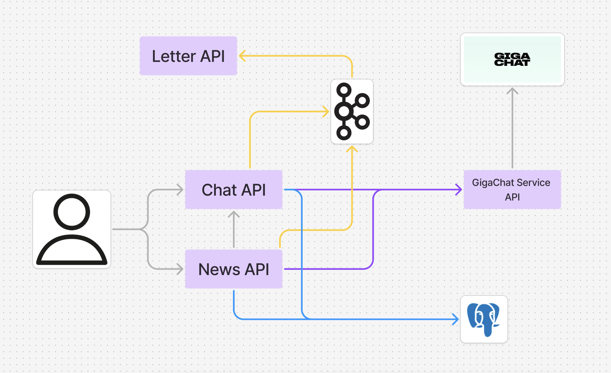

# 💚 **Doctor AI 🏥**

🌟 **Doctor AI** — это **интеллектуальный бэкенд-помощник** для выявления легких заболеваний по симптомам, указанным пользователем.  
Проект основан на **микросервисной архитектуре** и интегрирован с **AI (GigaChat)** для анализа заболеваний.

## 🌍 **Архитектура проекта**


## 🎯 **Цель проекта**
🔹 Создать **умного помощника**, который **анализирует симптомы** и **предлагает варианты лечения**.  
🔹 **Упростить диагностику** и **снизить нагрузку** на медицинские учреждения.

## 🚀 **Цель для разработчика**
🟢 **Изучить** микросервисную архитектуру  
🟢 **Освоить** Kafka для асинхронного взаимодействия сервисов  
🟢 **Разобраться** с Spring Cloud OpenFeign  
🟢 **Попробовать** Spring Security для защиты API  
🟢 **Углубить навыки** работы с Maven

## 🛠️ **Технологический стек**
| 🏗️ Категория      | 🚀 Технология          |
|------------------|------------------------|
| **Язык**        | Java 21                |
| **Фреймворк**   | Spring Boot            |
| **Архитектура** | Микросервисная         |
| **Сборщик**     | Maven                  |
| **Связь сервисов** | Spring Cloud OpenFeign |
| **Безопасность** | Spring Security        |
| **БД**         | PostgreSQL             |
| **ORM**        | Hibernate              |
| **Документация** | Swagger                |
| **Асинхронность** | Kafka                  |
| **Контейнеризация** | Docker                 |
| **AI**         | API GigaChat           |

## 🏗️ **Структура проекта**
📌 **Сервис диагностики** – принимает симптомы и передает в GigaChat.  
📌 **Сервис врачей** – предоставляет информацию по лечению легких заболеваний, при более серьезных заболеваниях рекомендует посетить врача.  
📌 **Сервис новостей** – ежедневно получает актуальные мировые события через **News API** и предоставляет свежую информацию пользователям.
## 🌟 **Функционал**
✅ **Прием симптомов** от пользователя  
✅ **Анализ и выявление заболевания**  
✅ **Генерация описания** возможного диагноза с помощью **GigaChat**  
✅ **Подбор врача** по выявленной проблеме  
✅ **Взаимодействие сервисов** через **FeignClient**  
✅ **Документированное API** (**Swagger**)  
✅ **Контейнеризация** (**Docker**)  
✅ **Защита API** с помощью **Spring Security**

---

## ⚡ **Запуск проекта**

📌 **1. Склонировать репозиторий:**
   ```sh
   git clone https://github.com/ellieene/doctor-ai.git
   ```
📌 **2. Открыть Docker Desktop**

📌 **3. Перейти в папку проекта и запустить через скрипт:**
   ```sh
   sh build.sh
   ```


---

🔥 **Doctor AI — умное здоровье в твоих руках!** 🚀  